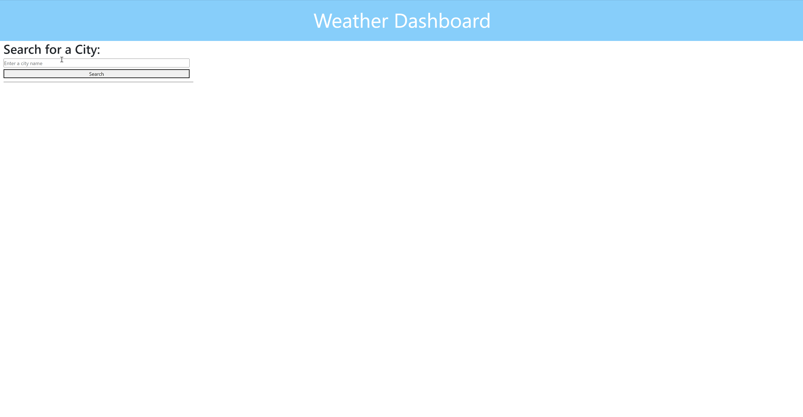

# weather-dashboard

## Description
The weather dashboard is a real time weather application that takes user input to search for a city and then displays the weather for that day in that city as well as the five day future forecast. The application displays the temperature, Wind Speed and Humidity along with the date and an icon representing the weather conditions. The day forecast for the city also displays the UV index for the day with a color coded background indicating weather the UV level is low, moderate or severe. When the user searches for a city it is saved and a button is created to search for that city again if they choose to do so.

## Table of Contents
* [Preview](#Preview)
* [Link](#Link)
* [Installation](#Installation)
* [Server Startup](#Server-Startup)
* [Packages](#Packages)
* [License](#License)
* [Contributing](#Contributing)
* [Questions](#Questions)

## Preview

## Link
[Weather Dashboard](https://vys-weather-dashboard.herokuapp.com/)

## Installation
* npm i
* Change .env.Example file to .env and insert your OpenWeather API key

## Server Startup
* npm start

## Packages
* cors
* dotenv
* express
* express-rate-limit
* node-fetch

## License

Copyright (c) [2022] [Vy Nguyen]

Permission is hereby granted, free of charge, to any person obtaining a copy of this software and associated documentation files (the "Software"), to deal in the Software without restriction, including without limitation the rights to use, copy, modify, merge, publish, distribute, sublicense, and/or sell copies of the Software, and to permit persons to whom the Software is furnished to do so, subject to the following conditions:

The above copyright notice and this permission notice shall be included in all copies or substantial portions of the Software.

THE SOFTWARE IS PROVIDED "AS IS", WITHOUT WARRANTY OF ANY KIND, EXPRESS OR IMPLIED, INCLUDING BUT NOT LIMITED TO THE WARRANTIES OF MERCHANTABILITY, FITNESS FOR A PARTICULAR PURPOSE AND NONINFRINGEMENT. IN NO EVENT SHALL THE AUTHORS OR COPYRIGHT HOLDERS BE LIABLE FOR ANY CLAIM, DAMAGES OR OTHER LIABILITY, WHETHER IN AN ACTION OF CONTRACT, TORT OR OTHERWISE, ARISING FROM, OUT OF OR IN CONNECTION WITH THE SOFTWARE OR THE USE OR OTHER DEALINGS IN THE SOFTWARE.

For more information, please visit: https://opensource.org/licenses/MIT

## Contributing
[Vy Nguyen](https://github.com/Vy187)

## Questions
If you have any questions about the repo, open an issue or contact me directly at vy1872@gmail.com